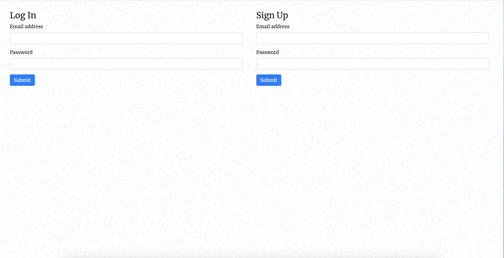
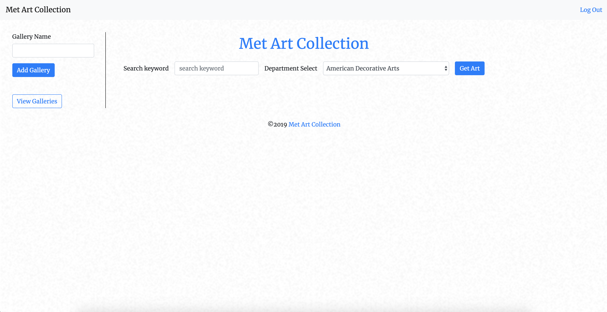
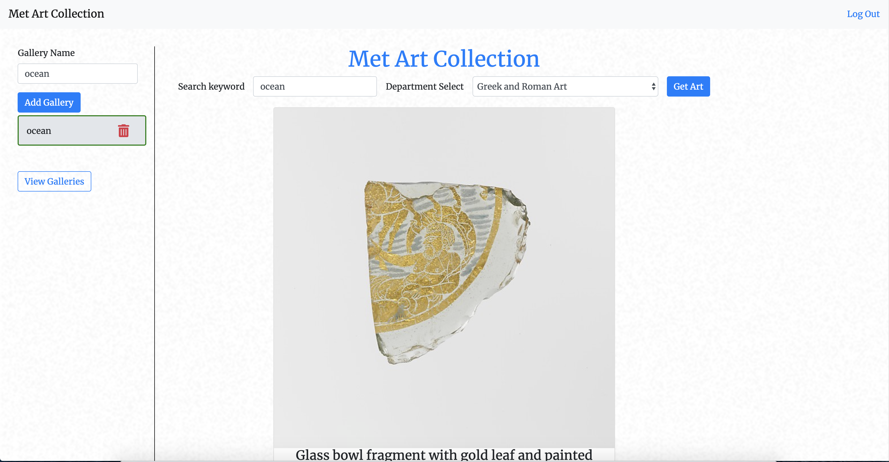
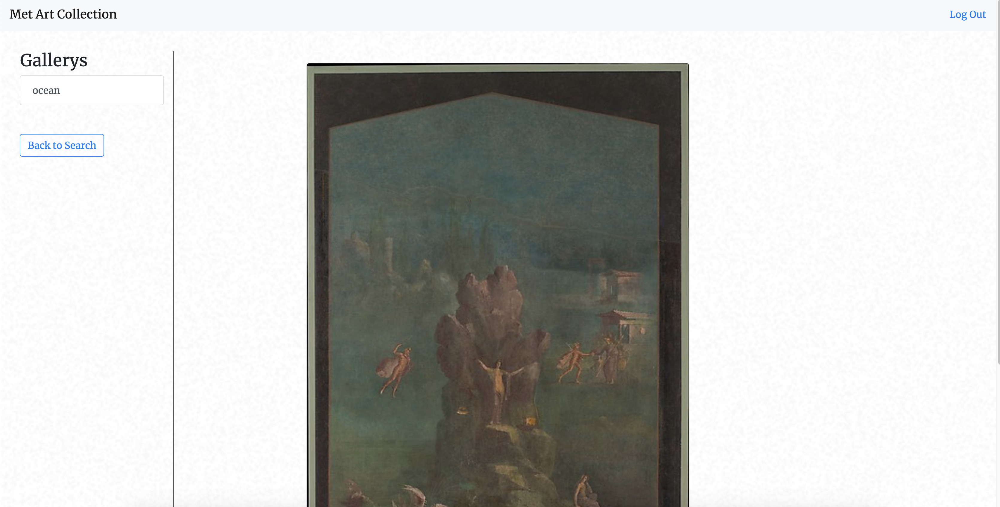

# Art-Tour
Virtual art collection

live site: https://art-tour.herokuapp.com/

This application utilizes the New York Met Art Gallery api to create a virtual art gallery experience. Users can click through different pieces of art that are housed within the Met. An image of the piece, the creator, it's title and date of creation are shown on the page. Users may create their own gallery by entering a gallery name into the upper left text box. Then by clicking on the newly created button from the submission, that gallery will be active and art may be saved to it. A user can then go view a gallery by clicking on the View Galleries button and they will be taken to the galleries page. There the user must click on a gallery and all the artwork in it will be shown. Art is saved in a MySQL database along with gallery names. The Sequelize ORM is used for querying the db. Styling is done with bootstrap and additional css. 

Log-in and Sign-up page: 

Search the api by adding a keyword and then selecting your choice of art exhibit

Create a gallery on the side bar, click and select the galllery and finally decide on the art piece you would like to add to it:

Click the galleries button to switch over and view the galleries you've created!

